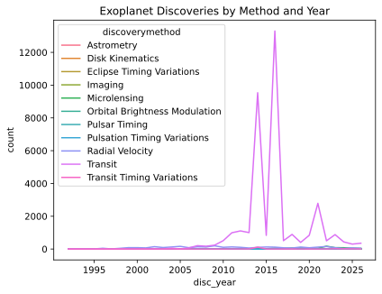
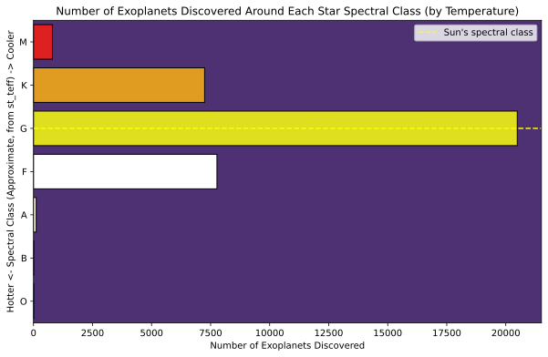
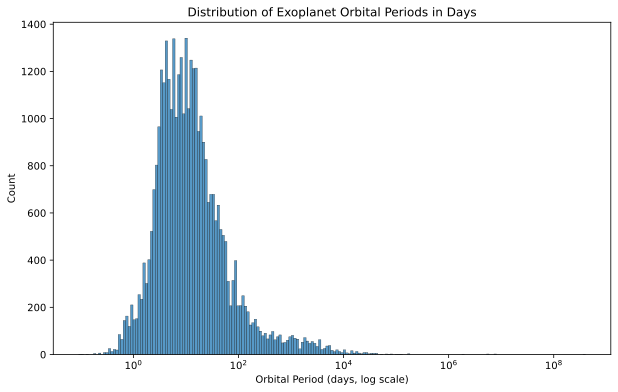
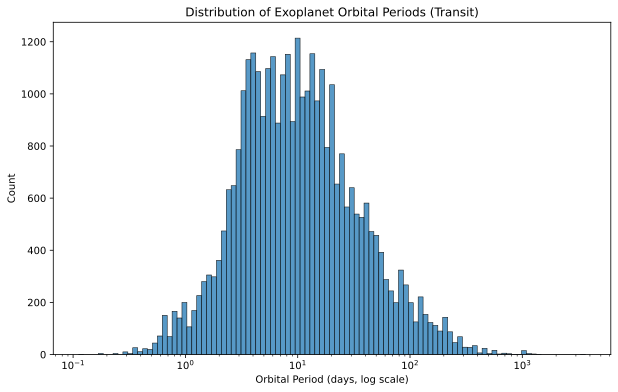

# Exploring the NASA Exoplanet Archive

## Overview
An open-ended exploration of NASA's Exoplanet Archive (~40,106 rows, 292 columns). 
No single question is driving this one. The goal was to dig into a rich, unfamiliar 
dataset and see what patterns, quirks, and data-quality lessons turned up along 
the way. From tracing artificial spikes in discovery timelines back to bulk
data-release events, to deriving a missing stellar object property using physics, 
to mapping thousands of host stars in interactive 3D space. 

## Data
- **Source:** [NASA Exoplanet Archive](https://exoplanetarchive.ipac.caltech.edu/cgi-bin/TblView/nph-tblView?app=ExoTbls&config=PS)
- **Size:** ~40,106 rows, 292 columns
- Loaded with a manually specified `optimized_dtypes` dictionary. Casting low-cardinality 
  fields (`discoverymethod`, `soltype`, `pl_letter`, `disc_locale`) to `category`, and 
  ID-like fields (`hd_name`, `hip_name`, `tic_id`, `gaia_dr2_id`) to `str` to preserve 
  them exactly, rather than letting pandas infer types

## What I Found

### 1. Discovery counts by year and method
Initially plotted discovery counts using `disc_pubdate` (publication date), which showed 
two large artificial spikes roughly in 2014 and 2016. Traced back to bulk statistical validation 
events, where NASA confirmed thousands of Kepler candidate planets in single batches. [source](https://www.nasa.gov/news-release/nasas-kepler-mission-announces-largest-collection-of-planets-ever-discovered/)
Switched to `disc_year` (actual discovery year) for a more accurate view, but even 
`disc_year` reflects official validation dates for these bulk-Kepler batches rather than 
when the underlying observations were first made. Documented quirk of how 
large-scale statistical validation gets dated, not a data error.

*Note:* When switching to `disc_year`, the graphic remained very similar. 

### 2. Star spectral type has too much missing data to use directly
`st_spectype` (categorical spectral classification, e.g. "G2 V") is missing in 92% 
of rows (36,972 of 40,106). The archive only populates this field when detailed 
spectroscopic follow-up literature exists, so most stars simply don't have it.

**Fix:** Used `st_teff` (stellar effective temperature, only 9% missing) instead, 
binning it into approximate spectral classes (O/B/A/F/G/K/M) using standard [Harvard 
Spectral Classification](https://lweb.cfa.harvard.edu/~pberlind/atlas/htmls/note.html) temperature boundaries, with a marker showing where the 
Sun (G-type) falls.

**Finding:** Exoplanets are overwhelmingly discovered around G-type (Sun-like) stars 
(~20k), despite M-dwarfs being the most common star type in the galaxy by far. This 
reflects survey target-selection criteria (brightness, stellar size, distance). 
Faint M-dwarfs are harder to observe with sufficient signal, so detections skew toward 
brighter, Sun-like stars. This is a detection bias, not evidence that exoplanets are more 
common around G-type stars.

### 3. HR Diagram and a Missing Luminosity Problem Solved with Physics
Built an HR diagram (temperature vs. luminosity) of host stars, using the standard 
astronomical convention of an inverted temperature axis (hot stars on the left).

`st_lum` (luminosity) was missing in 73% of rows. Too much to use directly. Checked 
`st_rad` (stellar radius) instead, which was only missing 2.4%. Used the 
Stefan-Boltzmann law to derive luminosity from radius and temperature:

L/L☉ = (R/R☉)² × (T/T☉)⁴

(t_sun = 5772 K, per IAU 2015 [Resolution B3](https://iopscience.iop.org/article/10.3847/0004-6256/152/2/41).) Verified the derivation against the 
archive's own `st_lum` values where both existed. Correlation of 0.998, confirming 
the derived values are reliable. Filled missing `st_lum` values with the derived 
version (`st_lum_final`), recovering the vast majority of the 73% that would 
otherwise have been dropped.

Produced three versions of the HR diagram:
- Full dataset (O-type outliers visible far to the left)

- O/B types removed, to focus on the dense main cluster

- Zoomed further to K/G/F types specifically, the most common in the dataset

Each uses a spectral-class color palette approximating real stellar colors 
(blue/aqua for hot O/B stars through red for cool M stars) against a dark purple 
background, with labeled temperature-boundary lines instead of a standard legend.

### 4. Host Stars in 3D Space
Converted each star's sky position (`ra`, `dec`) and distance (`sy_dist`) into 
Cartesian coordinates (x, y, z), placing Earth/the Sun at the origin. Plotted with 
Plotly for interactivity (rotate/zoom/hover), colored by spectral class, with a 
black space-like background. 
`sy_dist` was only missing in 1.8% of rows (658 of 36,441), so this used nearly the full cleaned dataset.

*Note:* Interactive map at [View the interactive 3D map](https://htmlpreview.github.io/?https://github.com/jsdelgadomal/NASA-Exoplanet-Exploration/blob/main/Outputs/exoplanet_3d.html)

This section was driven mostly by personal curiosity of to see exoplanet host 
stars laid out in actual 3D space. One limitation worth noting: the dataset spans a 
relatively narrow slice of the galaxy immediately around the Sun, since exoplanet surveys
toward the galactic core or outer disk are not included in this dataset.

### 5. Missing data is heavily concentrated in planetary characterization columns
With 292 columns, checking missingness column-by-column isn't practical — instead, 
looked at the overall shape of missingness across the dataset.

**Step 1: Sort by missing percentage.**

The top of this list is noticeable: the 30th-most-missing column is still 95% missing, 
the 50th is 93%, the 100th is 82%, and even the 140th column is 46% missing. 

*(A full missingness chart across all 292 columns is saved separately due to its size. 
See [`Outputs/missing-data-full.svg`](Outputs/missing-data-full.svg) in the repo for 
the complete column-by-column breakdown.)*

**Step 2: Bucket columns into missing bands** for a clearer overall picture:
| % Missing | # of Columns |
|-----------|--------------|
| 0-10%     | 104          |
| 10-25%    | 17           |
| 25-50%    | 36           |
| 50-75%    | 20           |
| 75-90%    | 49           |
| 90-100%   | 63           |
Over a third of all columns (112 of 292) are missing more than 75% of their values.

**Step 3: Check what kind of columns dominate the sparsest end.** 

Grouping the ~100 most sparsely populated columns by their prefix (the archive's naming convention: 
`pl_` = planet, `st_` = star, `sy_` = system):
| Prefix | Count |
|--------|-------|
| `pl_`  | 61    |
| `sy_`  | 22    |
| `st_`  | 15    |
*(`hd_` and `hip_` catalog-ID columns, 1 each, excluded as not relevant to this breakdown.)*

**Interpretation:** Confirming an exoplanet's existence (via transit or radial 
velocity) is far easier than fully characterizing it. Basic orbital/size estimates 
exist for most planets, but detailed properties (atmospheric composition, precise 
mass, eccentricity, etc.) require extensive follow-up observation only done for a 
small, well-studied subset. Stellar properties, by contrast, are easier to measure 
directly from the host star's own light, consistent with what was found earlier 
with `st_spectype` (92% missing) versus `st_teff` (9% missing) and `st_lum` 
(73% missing).

### 6. Exoplanet Orbital Periods
Used `pl_orbper` to look at the distribution of exoplanet orbital periods, in days. 
Found a right-skewed histogram, showing a small number of outliers driving up the 
overall orbital period.

Looking at the top 1% of orbital periods (≥ 3,397.7 days, n=367), Radial Velocity 
(80.9%) and Imaging (13.6%) together account for ~94.5% of these extreme long-period 
detections. Both methods capable of catching slow, wide-separation orbits that 
transit mechanically cannot. Transit itself makes up just 0.3% of this extreme tail, 
despite otherwise dominating the dataset (89.55% of all discoveries).

Filtering to transit-only discoveries (89.55% of the dataset) shows a tighter, though 
still right-skewed, distribution. The mean (23.89 days) is notably higher than the 
median (9.45 days), showing a small number of long-period exoplanets are still 
pulling the average up.

Looking at the histogram and the IQR (Q1: 4.17 days, Q3: 21.52 days) shows 
transit-detected exoplanets typically have orbital periods ranging from about 
4 to 22 days. Meaning most of these exoplanets orbit very close to their host star.

Transit method is mechanically biased toward detecting shorter-period exoplanets, 
since confirming a transit typically requires observing multiple repeated events 
within a survey's monitoring window. A planet with a multi-year orbit transits far 
less often, making it harder, though not impossible, to catch enough repeats for 
confirmation. This matches what's seen in the data: the median transit-detected 
period is just 9.45 days, though periods extending beyond 365 days are still 
present, likely from longer surveys like Kepler's continuous 4-year observation 
window.

**Example of a transiting planet:**

The dip seen between phase 0.0 and 0.2 shows an object transiting in front of the 
star, like a planet!

*Note: KIC 11904151 is the catalog identifier for the star Kepler-10.*
 
### 7. Stellar Mass: a Derivation Attempt that Didn't Hold Up (and why that's informative)
`st_mass` is missing in 16.31% of rows. Given the earlier success deriving luminosity 
from radius and temperature using Stefan-Boltzmann's law, attempted the same approach 
here using the **mass-luminosity relation** for main-sequence stars:

M/M☉ ≈ (L/L☉)^(1/3.5)

Using the recovered `st_lum_final` values, computed `st_mass_derived` and checked it 
against the archive's own `st_mass` values where both existed.

**Result:** Correlation of 0.764, a much weaker relationship than the 0.998 seen with 
the luminosity derivation. This makes sense: unlike Stefan-Boltzmann, which is an exact 
physical law, the mass-luminosity relation is only an empirical approximation. The 
exponent (3.5) isn't truly constant. It varies across the stellar mass range and the 
relation breaks down entirely for stars that aren't on the main sequence (giants, 
subgiants, etc.), which the dataset doesn't distinguish from "normal" stars at a glance.

**Decision:** Given the weaker correlation, `st_mass_derived` was 
**not** used to fill missing values. The original 16.31% missing in `st_mass` was 
left as-is rather than risk introducing unreliable estimates into any downstream 
analysis. This is a deliberate contrast to the luminosity derivation. Not every 
physics-based shortcut is equally reliable, and it's worth validating each one on its 
own terms rather than assuming a technique that worked once will always work.

## Next Steps
- Deeper look at planetary (`pl_`) columns specifically, given they dominate the 
  missing-data long tail. Narrowing in on what's usable vs. what's too sparse
- Possible galactocentric-distance conversion for the 3D visualization, including marking 
  notable reference points (Sag A*, nebulae, Betelgeuse, pulsars)
- Try deriving `st_mass` via stellar density and radius (M = ρ × (4/3)πR³, an exact 
  geometric relation from the definition of density) using `st_dens` and `st_rad`. 
  Note: `st_dens` is itself missing in 43.53% of rows, the sparsest of the four 
  originally-checked columns, so this would primarily serve as a validation check 
  against the mass-luminosity approach's weaker 0.764 correlation, rather than a way 
  to recover additional missing data.

## Tools
Python, pandas, numpy, seaborn, matplotlib, Plotly, lightkurve

## Acknowledgments
Stefan-Boltzmann derivation guidance discussed with Claude (Anthropic); underlying 
physics is standard astrophysics (IAU 2015 Resolution B3 for solar reference values).

## How to Run
1. Download the dataset from the [NASA Exoplanet Archive](https://exoplanetarchive.ipac.caltech.edu/cgi-bin/TblView/nph-tblView?app=ExoTbls&config=PS), selecting "Download all rows" and "Download all columns" from the drop-down menu.
2. Update the file path in the first cell of the notebook (right-click the downloaded file and select "Copy as path", then paste it inside `pd.read_csv()`).
3. Run all cells.